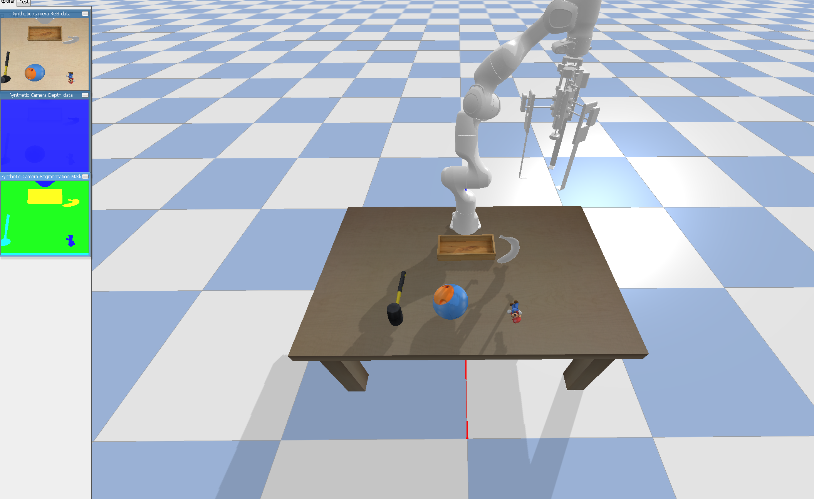
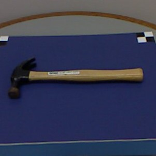
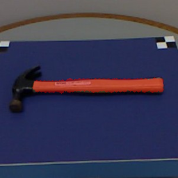
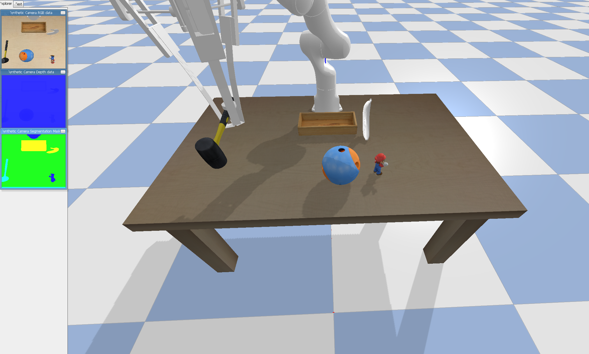

# AffCorrs Caging gripper integration 

This repository contains code for AffCorrs-gripper model, an autonomous robotic manipulation system integrating a novel visual semantic model in paper "One-Shot Transfer of Affordance Regions? AffCorrs!" and a novel robotic gripper in paper "A  Caging  Inspired  Gripper  using  Flexible Fingers  and  a  Movable Palm" along with reinforcement learning.


## Setup

The following code installs pybullet and clones this repository along with the submodule links needed for the RPL robots in this repo. The setup has been tested on ubuntu 20.04 and python 3.8.

```bash
git clone --recurse-submodules https://github.com/RPL-CS-UCL/RPL-affcorrs-gripper.git
cd RPL-affcorrs-gripper
pip3 install -e .
```

## install dependencies for affcorrs:

The code has been tested with the following packages:

```python
pydensecrf=1.0
torch=1.10+cu113
faiss=1.5
pytorch_metric_learning=0.9.99
fast_pytorch_kmeans=0.1.6
timm=0.6.7
cv2=4.6
scikit-image=0.17.2
```

However, other versions of these packages will likely be sufficient as well.

```
pip3 install pydensecrf torch torchvision timm cv2 scikit-image\
faiss pytorch_metric_learning fast_pytorch_kmeans
```

Verify installation runs without error:
```bash
cd /
python3 -c "from rpl_pybullet_sample_env.pybullet_robots.arms.panda import RPL_Panda"
```

## Running 

To run, simply execute `python3 examples/run_example_pick_handle.py`. This will spawn the RPL panda robot with the caging gripper on a table. You can move the camera in the simulation by holding `CNTRL` and dragging with the mouse. The model should be loaded in seconds even using CPU.

By default, the camera on the RPL Panda is disabled. Modify the `sim_camera` parameter to simulate it.

### Load robot and table objects	

Close the window tab to proceed

### Input semantic knowledge
| Support Image | Query Image |
|:--------------:|:--------------:|
|  |  |

### Transfer the semantic knowledge to the target scene

Close the window tab to proceed

### The caging gripper proceeds to grasp the target (with reinforcement policy control)


